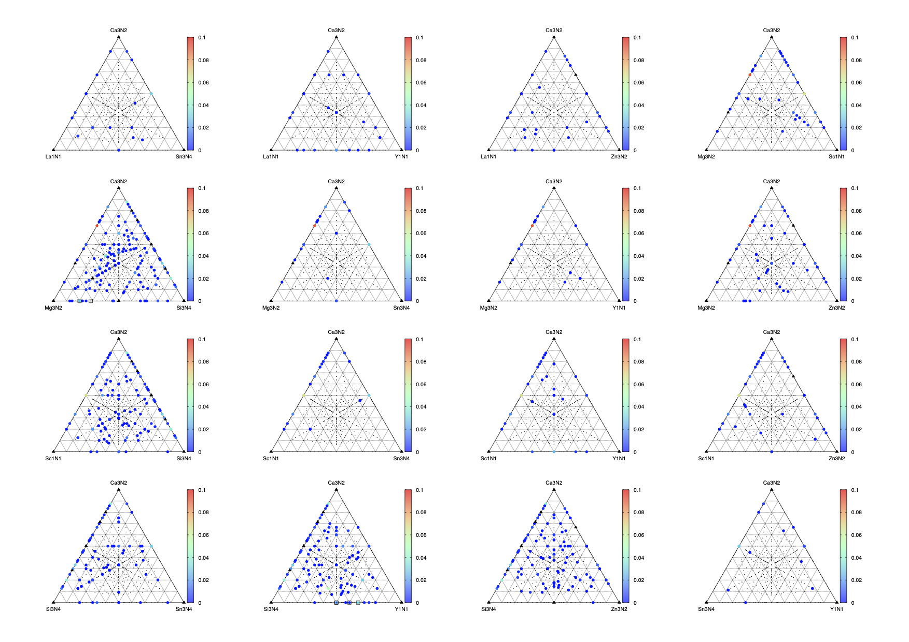

# Recommender system database for finding unknown inorganic compounds

The present tensor-based recommender system database provides currently unknown chemically relevant compositions from database entries (ICSD, ICDD, and Springer Materials). 
If you use the recommender system database for academic purposes, please cite the following article [1].

[1] [A. Seko, H. Hayashi, H. Kashima and I. Tanaka, "Matrix- and tensor-based recommender systems for the discovery of currently unknown inorganic compounds", Phys. Rev. Materials 2, 013805 (2018)](https://journals.aps.org/prmaterials/abstract/10.1103/PhysRevMaterials.2.013805) 

## Notes on sqlite database
The sqlite database of recommender-\*.sqlite is distributed using Git LFS. 
The database can be downloaded separately from recommender.py. 
Enter the link of recommender-\*.sqlite, and click on the Download link.

## Examples
```
> python3 $(recommender)/recommender.py -e Al Si O -n 4 -d recommender-2024-06-29.sqlite
# Composition, Score
  Al2Ba2O7Si1   0.74232
  Al2O12Si3Zn3   0.4814
  Al1Li1O12Si5   0.41613
  Al2Ba3O14Si4   0.39355
  Al2O14Si4Sr3   0.34611
```

```
> python3 $(recommender)/recommender.py -e N -n 4 -d recommender-2024-06-29.sqlite
# Composition, Score
  Ba2Li3N4Sb1   0.48867
  Ba2Cu1Li1N2   0.4738
  Ba3Li4N6Si2   0.46901
  Li3N4Sb1Sr2   0.4068
  Ba3Ge2Li4N6   0.39811
  Li1Mo2N7Sr4   0.3572
```
```
> python3 $(recommender)/recommender.py -e Al Ga O -n 5 -d recommender-2024-06-29.sqlite
```
```
> python3 $(recommender)/recommender.py -e Mg Zn -n 2 3 -d recommender-2024-06-29.sqlite
# Composition, Score
  Zn1Mg3   0.39168
  Zn1Mg2   0.37147
  Mg1Zn4   0.26386
  Mg1Zn3   0.24094
  Zn1Mg4   0.2309
  Mg1Zn6   0.16608
```
```
> python3 $(recommender)/recommender.py -e Mg Zn -n 2 3 --threshold 0.3 -d recommender-2024-06-29.sqlite
# Composition, Score
  Zn1Mg3   0.39168
  Zn1Mg2   0.37147
```

## Default parameters
- elements: None
- n (number of atomic species): 3
- threshold: 0.01

```
usage: recommender.py [-h] [-d DATABASE] [-n [NARY ...]] [-e [ELEMENTS ...]]
                      [--threshold THRESHOLD]

options:
  -h, --help            show this help message and exit
  -d DATABASE, --database DATABASE
                        Database name
  -n [NARY ...], --nary [NARY ...]
                        Number of atomic species in recommended compositions
  -e [ELEMENTS ...], --elements [ELEMENTS ...]
                        Elements in recommended compositions
  --threshold THRESHOLD
                        Score threshold for recommendation
```


